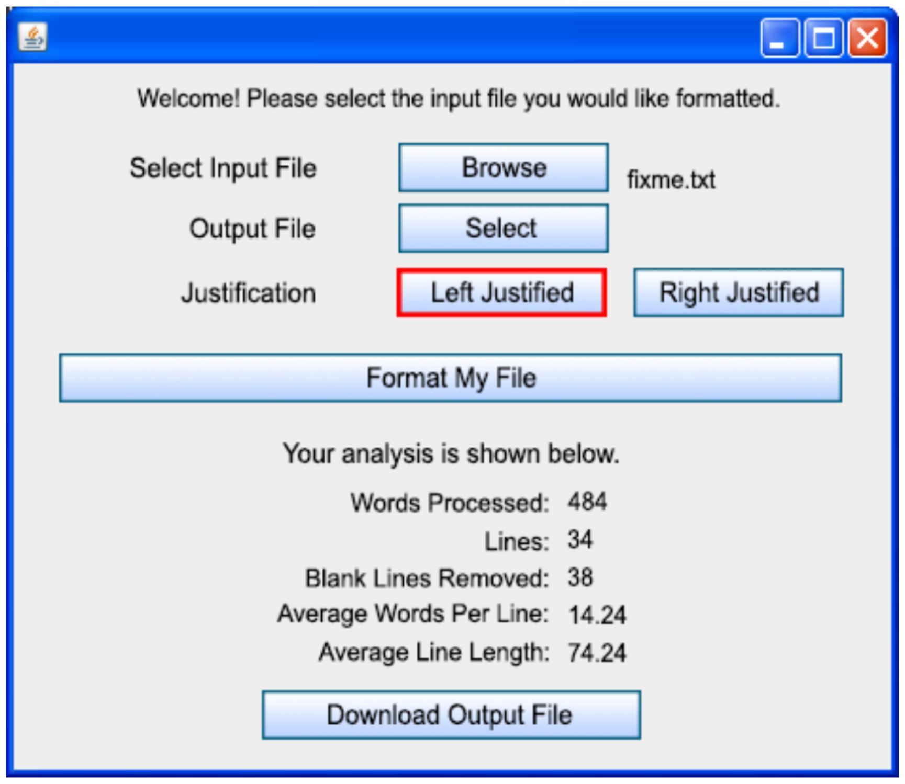

# User Guide, CSE 360 - Spring 2018

### Members
<p>Lior Peer</p>
<p>Karisa Kauspedas</p>
<p>Tin Pham</p>
<p>Luke Mains</p>

# TO DO:
<li>Right Justify/Left justify at the same time? (Full justification)</li>
<li>Set a specific line length</li>
<li>Find out how many spaces were added</li>
<li>Single spaced or double spaced</li>

Due - 30 March, User guide with 3 test cases

Exam in 2 weeks


## Introduction:
<p>The purpose of this document is to record the process of building and implementing a text analysis GUI. This includes an overview and an explanation of how to use the program.</p>

## Overview

<p>This program will demonstrate a GUI version of an input and output of a .txt file. The program will analyze the .txt file that the user choose and plot the following requirements that the user request such as; number of word processed, lines, blank lines that removed, average word per a line and average line length. The goal of this program is to have an friendly user interface environment that will be easy to use.

The purpose of this program, is to create friendly user interface by using a GUI that will meet the user requirements, analyze and plot the .txt correct result. The user will choose a file for the input and will get an output file as the result.</p>

## Installation / Getting Started

Step 1: Download the program.
```
*insert download link?*
```

Step 2: Choose file location to upload to the GUI.
Step 3: Select justification (Right or Left).
Step 4: Click ‘Format My File’.
Step 5: Download output file.
Step 6: View results in new window.

## User Interface Prototype

